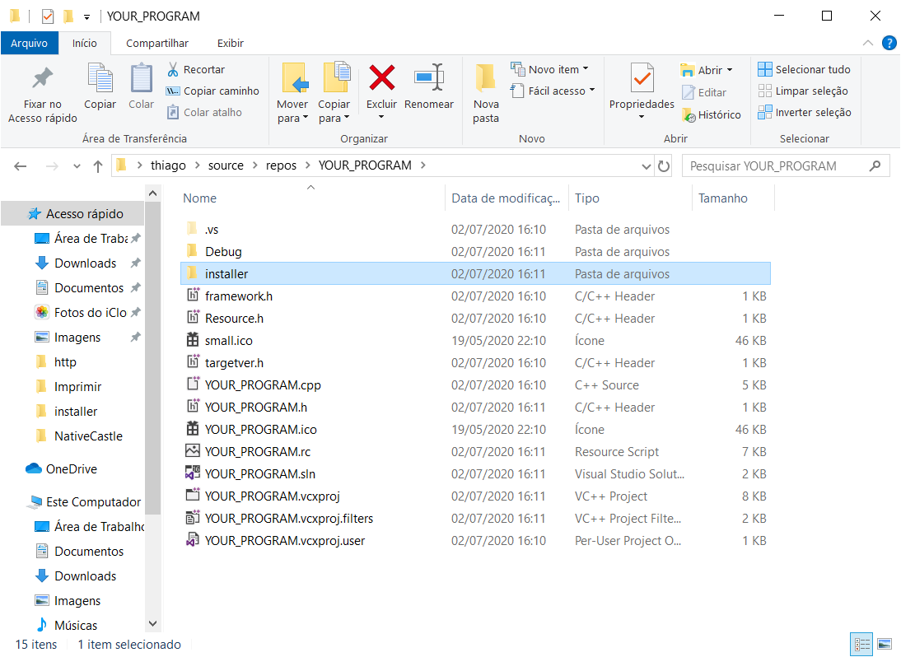
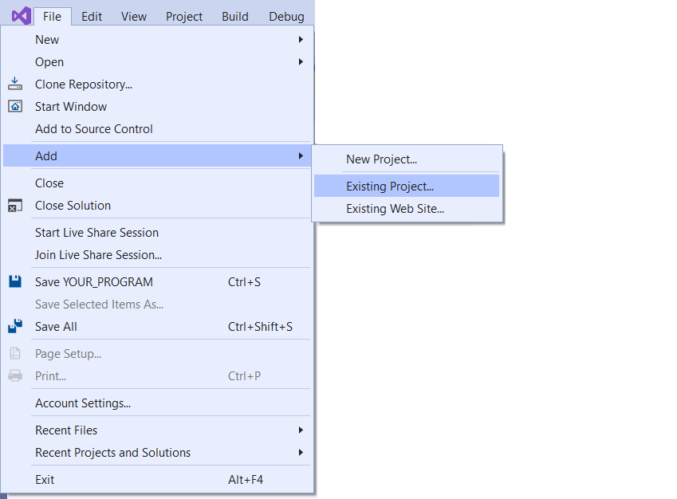
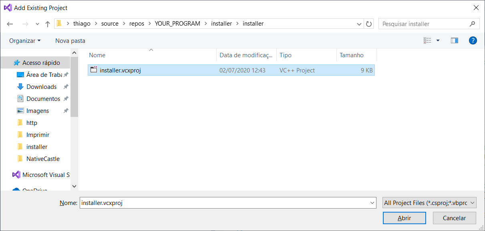
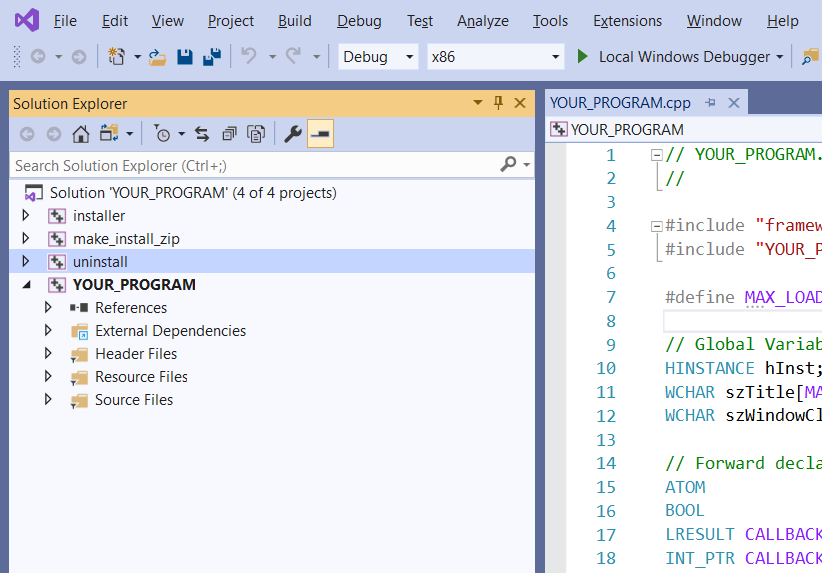
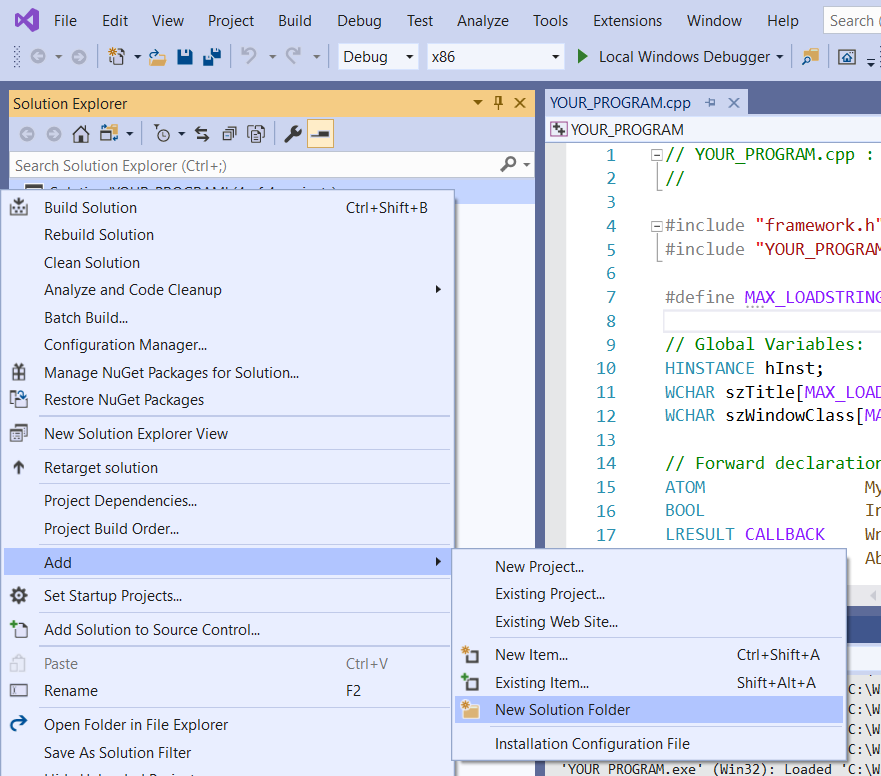
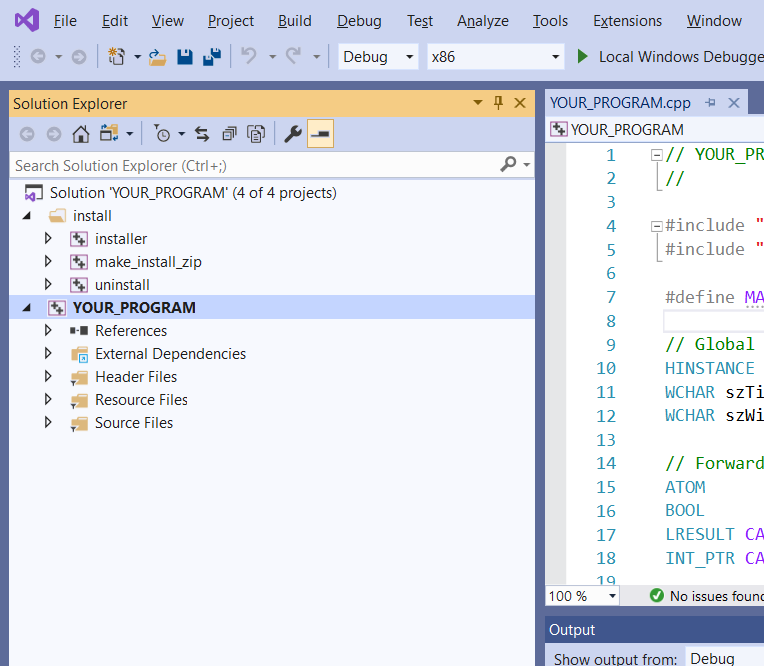
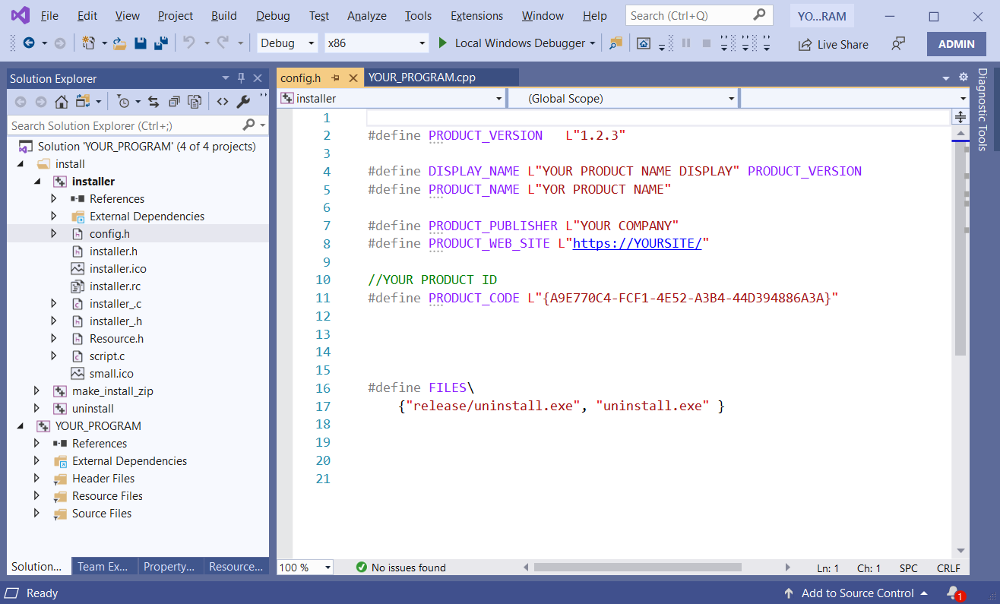

# Embedded Install System - Zero dependencies

Generate installer inside your normal VC++ build.

## Using it

 * Download **installer_src.zip**
 * **Copy** the folder **installer** into your project. 
   (This folder is inside installer_src.zip)



 * **ADD** these 3 existing projects in your solution: **installer** , **make_install_zip** and **unistall**





You will see this



You can put these files inside a folder






Then **EDIT the config.h** with yout product details. Add the files you need to install.

Run the project in a especific order. First build zip files then unistall then install. Add your exe and all other files you need.



You can especify the build order in your project and also compilation step to run make_install_zip.

Build order
```
 1) Your program
 2) unistall (creates the unistall program)
 3) make_install_zip (creates the files.zip with your program the unistall program and all your files)
   You also needs to run make_install_zip
 4) installer (this will create the intaller)

```

file script.c is used for other customizations. There is only one event today. 

## Contributing

This section is necessary only if you want to contribute with the project and understand
how to use the projects/solutions.

### build_amalgamation
 This solution builds the amalgamated (installer_.h and installer_.c) versions of all files needed.
 
 ### make_instaler_zip_src
 This solution creates the installer_src.zip that is the source code that the user must  include in their project to create installers.
 
 ### make_install_zip
 This solution creates the files.zip that contains all files that are copied during instalation. We must create files.zip before run installer
 
 ### installer
   This project creates the instaler. It uses the files.zip created by make_install_zip. It alo needs uninstall.exe created bt uninstall solution
 
 ### installer_debug
   The same of installer but we can use the not almagamated version for easy edit.
 
 ### installer
   This project create uninstall.exe that is included inside the instalation and it is used when the program is unistalled.
   
