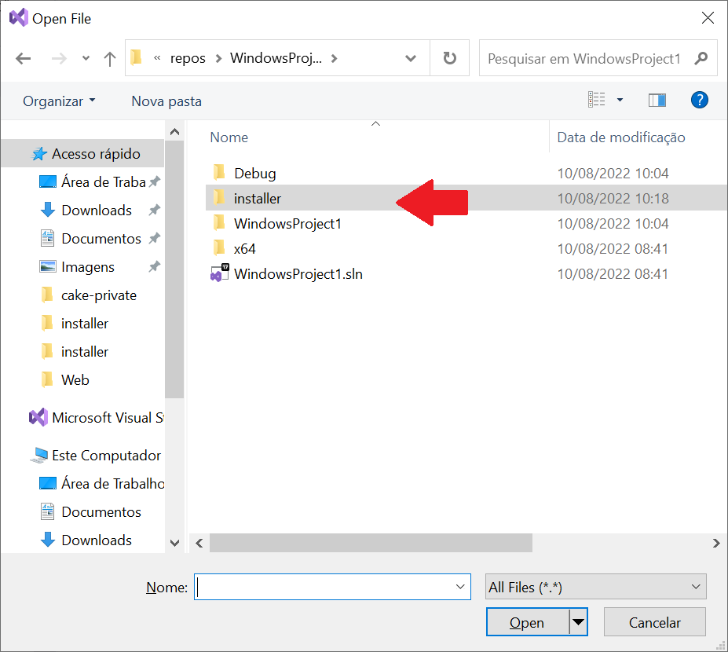

# Embedded Install System - Zero dependencies

WARNING : THIS PROJECT NEEDS MORE DEVELOPMENT TO BECOME ROBUST.

Generate windows installer inside your normal VC++ build.

If you already use C/C++ and Visual Studio it means you can have
an installer without external dependencies.

You can debug your installer and you don't need a crazy macro language 
to customize your actions.


## Using it

* Download [installer.zip](installer.zip)
 
* **Copy** the folder **installer** into your project. 



 **ADD** these 3 projects in your solution
 
 * installer (This is the instaler project)
 * makezip  (This project creates the zip file that is embedded as a resource inside the installer)
 * unistall (This is the uninstall program)


Result:


I use this projects inside a folder


* **EDIT the script.h** with yout product details

Sample:

```cpp

#define PRODUCT_VERSION   L"1.2.3"
#define DISPLAY_NAME L"Castle " PRODUCT_VERSION
#define PRODUCT_NAME L"Castle"

#define PRODUCT_PUBLISHER L"thradams"
#define PRODUCT_WEB_SITE L"https://github.com/thradams/castle"

#define PRODUCT_CODE L"{B1393753-AE0C-41D0-AC75-94C40DE17989}"

/*
  These files {source_path, dest_path} will be copied to the instalation dir
*/
#define FILES\
    {"release/uninstall.exe", "uninstall.exe" },\
    { "release/castle.exe", "castle.exe" },\
    \
    { "default/core.min.js", "default/core.min.js" },\
    { "default/declarations.d.ts", "default/declarations.d.ts" },\
    { "default/Home.html", "default/Home.html" },\
    { "default/Home.ts", "default/Home.ts" },\
    { "default/htmlcore.min.js", "default/htmlcore.min.js" },\
    { "default/index.template.html", "default/index.template.html" },\
    { "default/manifest.json", "default/manifest.json" },\
    { "default/manifest.webmanifest", "default/manifest.webmanifest" },\
    { "default/style.template.css", "default/style.template.css" },\
    { "default/svgcore.min.js", "default/svgcore.min.js" },\
    { "default/tsconfig.json", "default/tsconfig.json" },\
    { "default/.vscode/launch.json", "default/.vscode/launch.json" },\
    { "default/.vscode/settings.json", "default/.vscode/settings.json" }
 ```
 


Required build order.

 1) Your program

 2) **unistall** 
   Creates the **uninstall.exe** program

 3) **makezip** 
    Creates the **makezip.exe** programs that runs (Event After Build) and creates the **files.zip** that is a embedded inside the installer.exe.

 4) **installer**
    This will create the intaller.exe

File script.c is used for customizations. 
There is only one event today **OnFilesExtracted** that happens after files have been copied. 

Once you understand the mechanics of the build you can use different approaches. Let's say
you already have an build script then you can move the installer build to another solution.

## Sample project (I was testing it)


script.c

I want to add the install dir into the path. So I put some extra code
at OnFilesExtracted event.

```c
/*
     THIS IS THE CUSTOMIZATION FILE
*/

#include "installer_.h"
#include "config.h"


void AddSystemVariablesPath(const wchar_t* pathToAdd);

void OnFilesExtracted()
{
  /*
    This function is called after all files and common registry keys
    were writtem    
  */
    AddSystemVariablesPath(INSTDIR);
}
```

