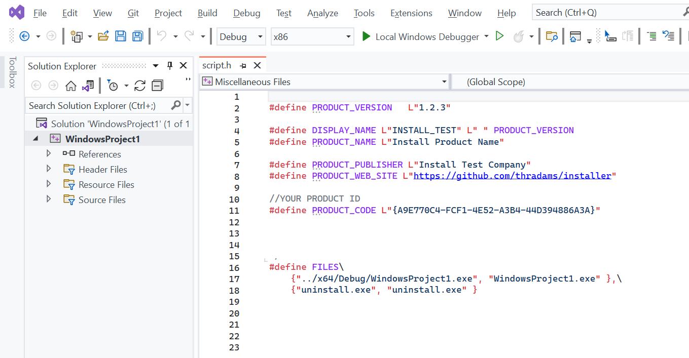

# Embedded Install System - Zero dependencies

WARNING : THIS PROJECT NEEDS MORE DEVELOPMENT TO BECOME ROBUST.

Generate windows installer inside your normal VC++ build.

If you already use C/C++ and Visual Studio it means you can have
an installer without external dependencies.

You can debug your installer and you don't need a crazy macro language 
to customize your actions.


## Using it

* Download the source code and **copy the installer folder to your project**.
 


* **EDIT the script.h** with your product details
* Change PRODUCT_CODE
* Edit the document license.rtf

Sample:

```cpp

#define PRODUCT_VERSION   L"1.2.3"
#define DISPLAY_NAME L"Castle " PRODUCT_VERSION
#define PRODUCT_NAME L"Castle"

#define PRODUCT_PUBLISHER L"thradams"
#define PRODUCT_WEB_SITE L"https://github.com/thradams/castle"

#define PRODUCT_CODE L"{B1393753-AE0C-41D0-AC75-94C40DE17989}"

/*
  These files {source_path, dest_path} will be copied to the instalation dir
*/
#define FILES\
#define FILES\
    {"../x64/Debug/WindowsProject1.exe", "WindowsProject1.exe" },\
    {"uninstall.exe", "uninstall.exe" }
 ```




script.c

I want to add the install dir into the path. So I put some extra code
at OnFilesExtracted event.

```c
/*
     THIS IS THE CUSTOMIZATION FILE
*/

#include "installer_.h"
#include "script.h"

void AddSystemVariablesPath(const wchar_t* pathToAdd);

void OnFilesExtracted()
{
  /*
    This function is called after all files and common registry keys
    were writtem    
  */
    AddSystemVariablesPath(INSTDIR);
}
```


To debug use
```
make_installer_debug.bat
devenv /DebugExe installer.exe

```
