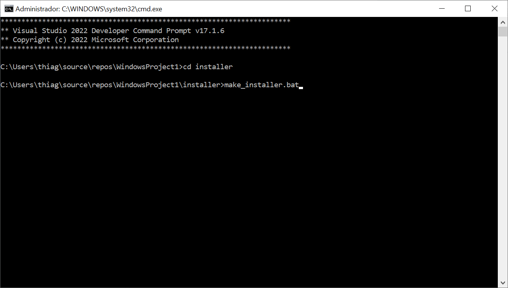

# Embedded Install System - Zero dependencies

If you already use C/C++ and Visual Studio it means you can have
an installer without external dependencies.

You can debug your installer and you don't need a crazy macro language 
to customize your actions.

## Basic concepts
The customization is done at **setup.h** and **setup.c**


## Build Pipeline

### 0 - Build the sofware you want to create the installer

### 1 - Build the uninstall program

### 2 - Create a zip file with all files required
       
### 3 - Build the installer

This pipeline is inside make_installer.bat 

## Using it

* Download the source code and **copy the installer folder to your project**.
 


* **EDIT the setp.h** with your product details
* Change PRODUCT_CODE
* Edit the document license.rtf


Open the command prompt


Run the bat file


To create and debug use
```
make_installer_debug.bat
devenv /DebugExe installer.exe
```

# Adding code into events on setup.c

```c
/*
     THIS IS THE CUSTOMIZATION FILE
*/

#include "installer_.h"
#include "script.h"

void AddSystemVariablesPath(const wchar_t* pathToAdd);

void OnFilesExtracted()
{
  /*
    This function is called after all files and common registry keys
    were writtem    
  */
    AddSystemVariablesPath(INSTDIR);
}
```


## See also

https://github.com/kuba--/zip
